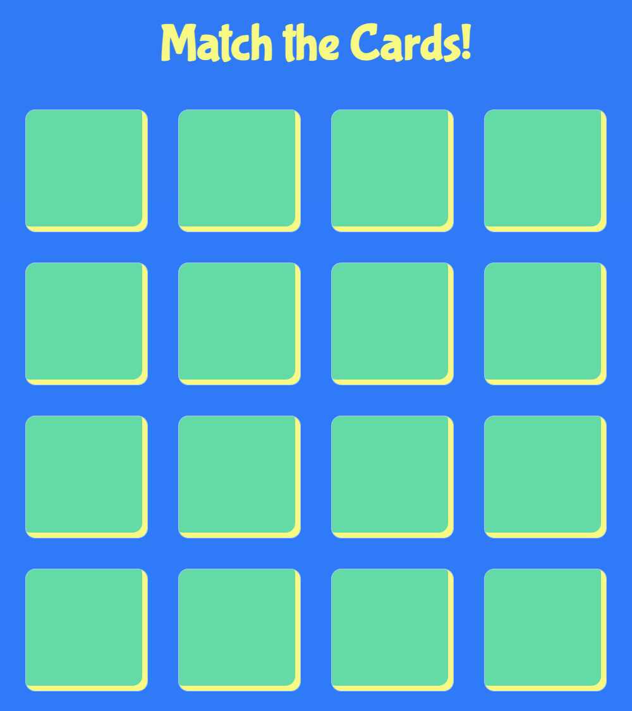
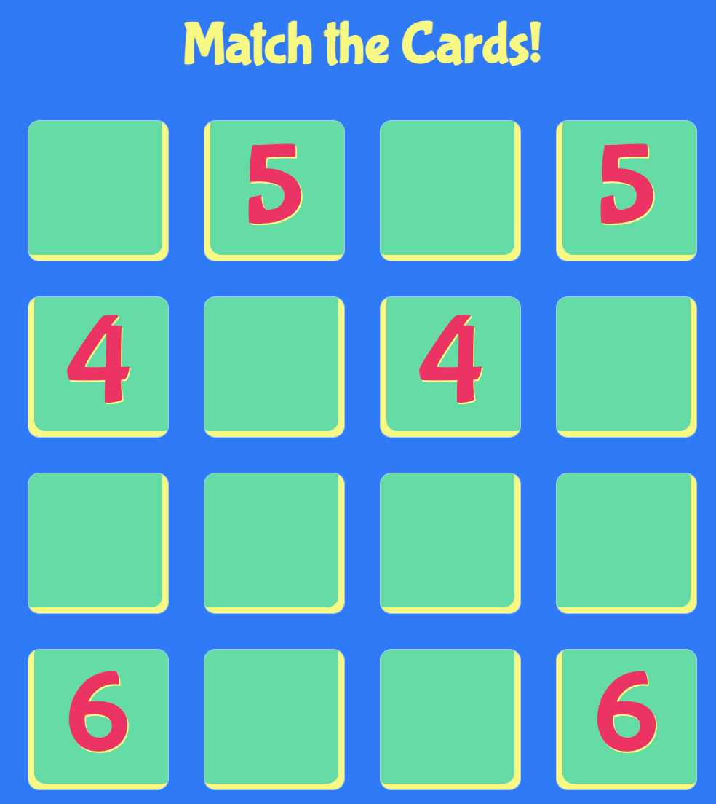
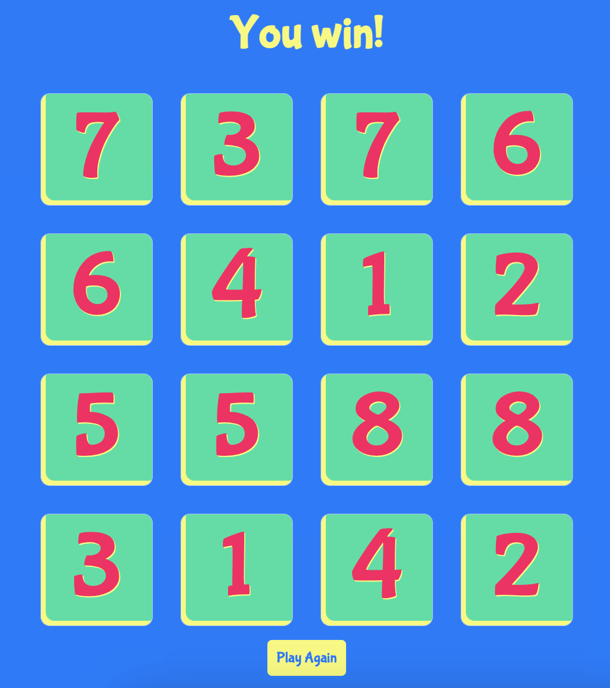

# Match Game

## Description

Match the numbers!

## Usage

Match these 16 cards.

Start matching cards.

Once you win the game, restart and play again.

## License

MIT License

## Deployed Application Link

Paste your deployed application link here.

https://scelsic2.github.io/match-game/
